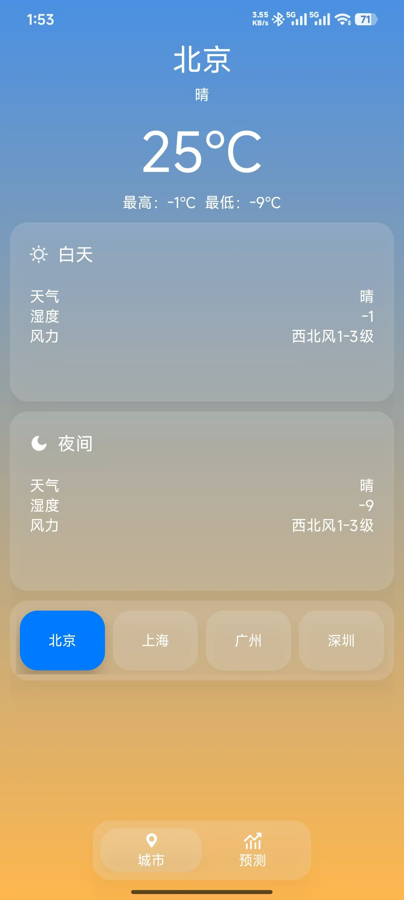

# android-app-homeworks
安卓课堂作业

## 项目介绍

本项目包含两个安卓应用程序：

### LoginApp
用户登录应用。用户可以使用账号密码进行登录，登录成功后会跳转到个人主页。
- **测试账号**：test@qq.com
- **测试密码**：1234

### WeatherApp
天气查询应用。支持查询北京、上海、广州、深圳等城市的实时天气信息，并提供近几天的城市天气预报。

